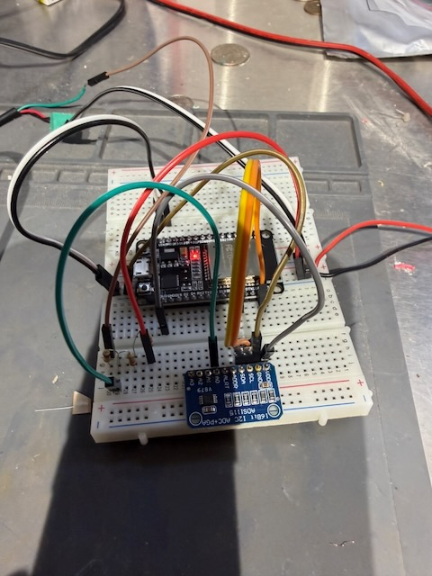
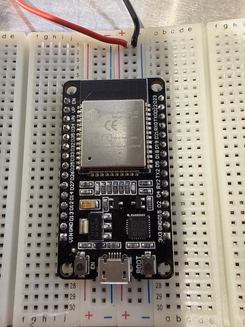
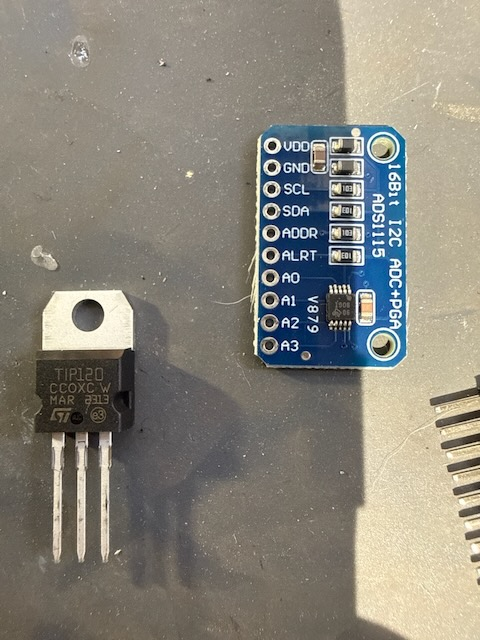

# Pool Filter Pressure Sensor for Home Assistant

Monitor your pool filter pressure in real time using an ESP32, ADS1115 ADC, and a ratiometric pressure transducer — published directly to Home Assistant via ESPHome.



---

## Why I Built This

Pool filters need to be backwashed when the pressure rises 8–10 PSI above the clean baseline. Without a sensor, you either check the gauge manually or guess. With this project, Home Assistant knows the pressure at all times and can alert you (or automate the backwash) automatically.

I started with an ESP32 I was already using as a BLE proxy, stripped out Bluetooth, added an ADS1115 I²C ADC, and wired in a screw-in pressure transducer at the filter outlet. The ADS1115 gives cleaner, more stable readings than the ESP32's built-in ADC, and lets me safely interface a 5V sensor signal with 3.3V logic using a simple resistor voltage divider.

This is also the first time I've ever really pulled together an ESP32 and breadboard project for something I couldn't find online (at any reasonable price). I would not have been able to do this without OpenAI and Anthropic (using each for skills where they are better). So consider this also my disclaimer that I didn't write any of this code, wow this is an amazing world we are going into. 

---

## Features

- Reads 0–60 PSI from a ratiometric 0.5–4.5V transducer
- Uses ADS1115 16-bit ADC for stable, accurate readings
- Voltage divider safely scales 5V sensor signal to 3.3V ADC range
- Publishes live PSI to Home Assistant every 2 seconds
- Compatible with ESPHome 2026.x and later
- Available as a standalone config or importable ESPHome package

---

## Hardware

### Parts List

| Part | Notes | Search |
|------|-------|--------|
| ESP32 DevKit V1 | 38-pin, micro-USB | [Amazon](https://www.amazon.com/s?k=esp32+devkit+v1+38+pin) |
| ADS1115 Breakout | 16-bit I²C ADC, 4-channel | [Amazon](https://www.amazon.com/s?k=ads1115+i2c+adc+breakout) |
| Pressure Transducer | 0–60 PSI, 5–12V supply, 0.5–4.5V output, 1/8" NPT, 3-wire | [Amazon](https://www.amazon.com/s?k=0-60+psi+pressure+transducer+0.5-4.5v+1%2F8+npt) |
| Resistor Kit | Resister kit if you don't have one already | [DigiKey](https://www.digikey.com/en/products/detail/sparkfun-electronics/10969/14671649) |
| Breadboard | Full or half size | [Amazon](https://www.amazon.com/s?k=breadboard+830+point) |
| Jumper Wires | Male-to-male and male-to-female | [Amazon](https://www.amazon.com/s?k=breadboard+jumper+wires+kit) |

**Total cost:** ~$20–30 USD depending on what you already have.


---

## Wiring

### Pressure Sensor → Voltage Divider → ADS1115

The sensor outputs 0.5–4.5V, but the ADS1115 (powered at 3.3V) and ESP32 are not 5V-tolerant. A resistor voltage divider scales the signal down safely.

```
Sensor OUT (Green) ─── 10kΩ ─── [NODE] ─── 22kΩ + 4.7kΩ ─── GND
                                    │
                               ADS1115 A0
```

**Divider math:**
- Rbottom = 22kΩ + 4.7kΩ = 26.7kΩ
- Ratio = 26.7 / (10 + 26.7) = **0.727**
- At max pressure: 4.5V × 0.727 = **3.27V** at ADS1115 (safe ✓)
- At zero pressure: 0.5V × 0.727 = **0.36V** at ADS1115 (safe ✓)

### Pressure Sensor Power

| Sensor Wire | Connect To |
|-------------|------------|
| Red (IN+)   | ESP32 VIN (5V from USB) |
| Black (GND) | ESP32 GND |
| Green (OUT) | Voltage divider top (10kΩ) |

> The sensor needs 5–12V supply. Use ESP32's VIN pin which passes through USB 5V directly.

### ADS1115 to ESP32

| ADS1115 Pin | ESP32 Pin |
|-------------|-----------|
| VDD         | 3V3 |
| GND         | GND |
| SDA         | GPIO 21 |
| SCL         | GPIO 22 |
| ADDR        | GND (sets I²C address to 0x48) |
| A0          | Divider node (junction of 10kΩ and 22k+4.7kΩ) |

> Power ADS1115 from ESP32's **3.3V** rail — not 5V. This keeps I²C signal levels safe for the ESP32.

### Full Wiring Diagram (ASCII)

```
USB 5V ──────────────────────────── Sensor Red (IN+)
                                     Sensor Black (GND) ──── GND
                                     Sensor Green (OUT)
                                           │
                                          10kΩ
                                           │
                                        [NODE] ──────────── ADS1115 A0
                                           │
                                          22kΩ
                                           │
                                          4.7kΩ
                                           │
GND ─────────────────────────────────────────

ESP32 3V3 ───── ADS1115 VDD
ESP32 GND  ───── ADS1115 GND
ESP32 GPIO21 ─── ADS1115 SDA
ESP32 GPIO22 ─── ADS1115 SCL
ADS1115 ADDR ─── GND  (I²C addr = 0x48)
```




---

## How It Works

The pressure sensor is a **ratiometric transducer**: output voltage is linear from 0.5V (0 PSI) to 4.5V (60 PSI).

**Slope:** 4.0V span ÷ 60 PSI = **15 PSI per volt**

The firmware:
1. Reads raw ADC voltage from ADS1115 channel A0
2. Reverses the voltage divider: `V_sensor = V_adc / 0.727`
3. Converts to PSI: `PSI = (V_sensor - 0.5) × 15`
4. Clamps negative values to 0 (sensor offset at low/zero pressure)

---

## Installation

### Option A — Standalone (easiest)

1. Copy `examples/esp32-devkitv1.yaml` to your ESPHome config directory
2. Copy `secrets.yaml.example` to `secrets.yaml` and fill in your credentials
3. Flash via USB: `esphome run examples/esp32-devkitv1.yaml`
4. Future updates work over OTA

### Option B — ESPHome Package Import

Add to your existing node YAML:

```yaml
packages:
  pool_pressure: github://earlcrane/ha-pool-pressure-sensor/esphome/pool_pressure_sensor.yaml@main
```

Override any substitution in your node file:

```yaml
substitutions:
  pool_sensor_name: "Spa Filter Pressure"  # rename the HA entity
  pool_divider_ratio: "0.730"              # if you used a 27kΩ resistor instead
  pool_update_interval: "5s"              # slow down polling
```

> **Note:** The package defines an `i2c:` bus on GPIO 21/22. If your node already defines I²C for other devices, remove the `i2c:` block from this package or merge the pin definitions manually.

---

## Calibration

The default `divider_ratio: 0.727` assumes 10kΩ top and 26.7kΩ (22kΩ + 4.7kΩ) bottom resistors.

If you use different values:
```
ratio = Rbottom / (Rtop + Rbottom)
```

For a 27kΩ bottom resistor:
```
ratio = 27 / (10 + 27) = 0.730
```

To verify: watch the raw ADC voltage reading in ESPHome logs. At a known pressure (e.g., 0 PSI on a disconnected system), the sensor should output ~0.5V. Divide that by your ratio — you should see ~0.36V in the logs.

---

## Home Assistant Integration

After flashing, the device will appear in HA's **ESPHome integration** automatically. You'll get:

- **Pool Filter Pressure** — PSI value, updates every 2 seconds
- **Safe Mode** and **Factory Reset** buttons for recovery

Create an automation to alert when pressure rises above your threshold:

```yaml
automation:
  - alias: "Pool filter needs backwash"
    trigger:
      - platform: numeric_state
        entity_id: sensor.pool_filter_pressure
        above: 25  # adjust to your baseline + 8-10 PSI
    action:
      - service: notify.mobile_app
        data:
          message: "Pool filter pressure is high — time to backwash!"
```

---

## ESPHome Version Notes

This config uses the **ESPHome 2026.x** ADS1115 structure where `address` and `continuous_mode` belong in the `ads1115:` hub block — **not** in `sensor:`. Earlier versions had a different structure. If you see `[address] invalid option for [sensor.ads1115]`, make sure your ESPHome install is up to date.

---

## License

MIT — see [LICENSE](LICENSE).
